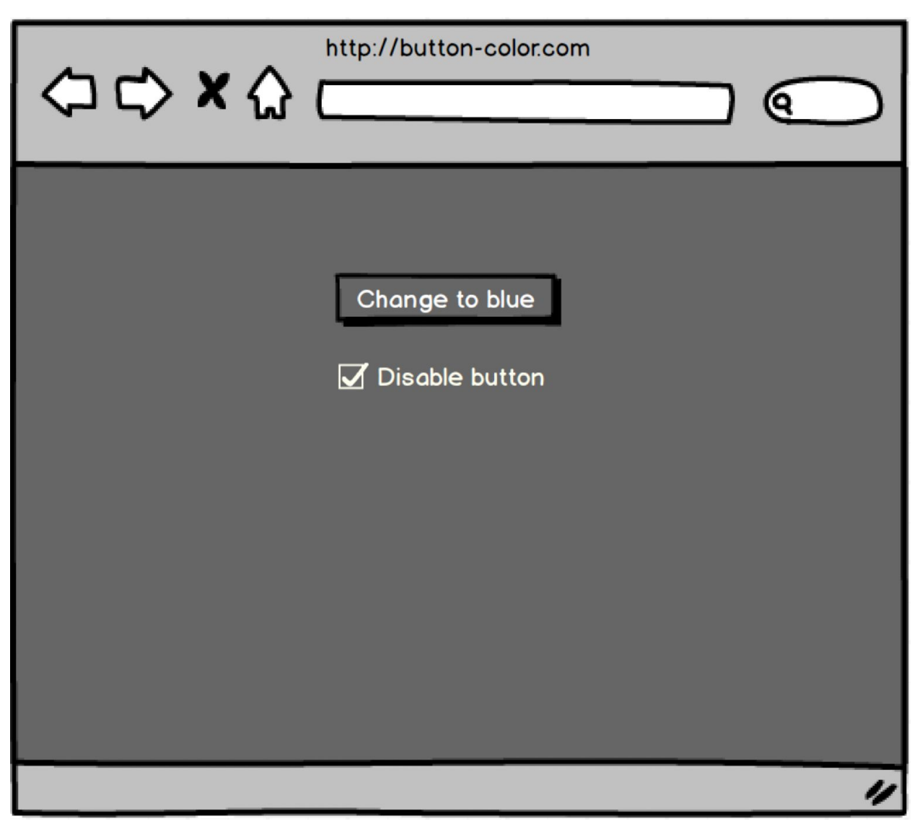

## Disabled Button Gray Code Quiz Spec

Mockup

Spec

- use web color "gray"
- Test flows:
  - disable button -> button is gray => enable button -> button is red
  - click button to change color -> disable button -> button is gray -> enable button -> button is blue

* Assertion at the end of each flow
  - we've written other code to assert on button color
