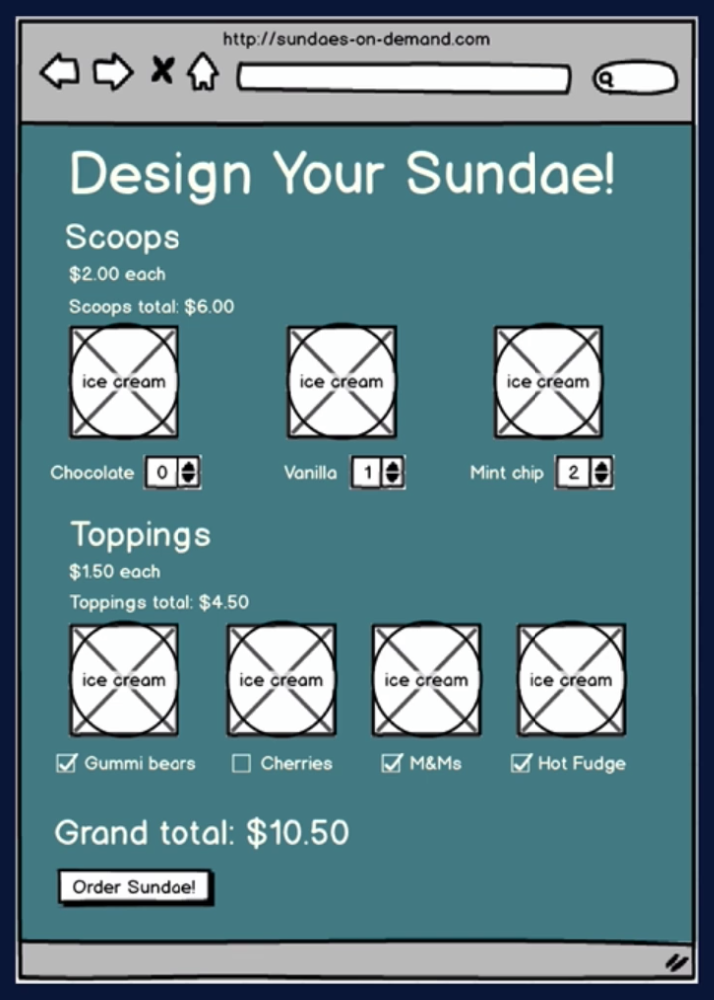
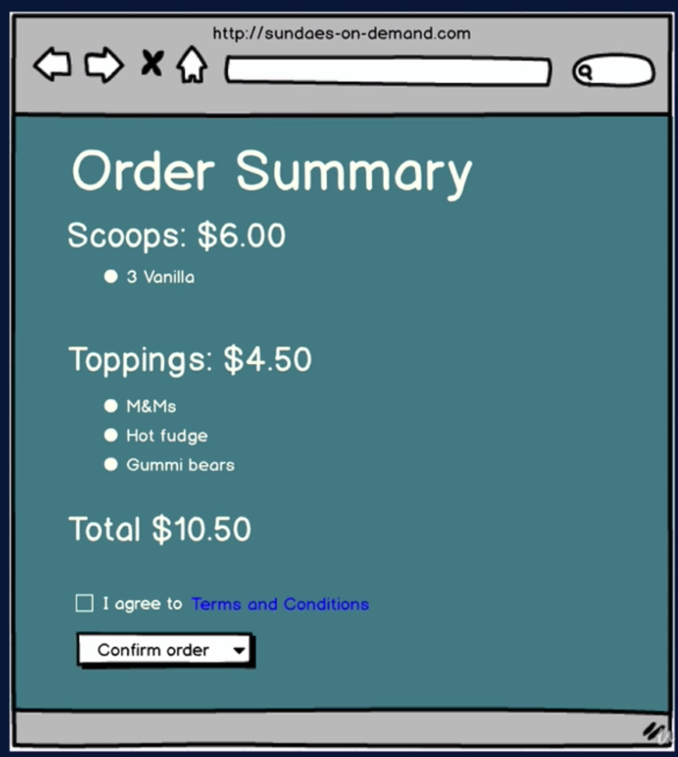
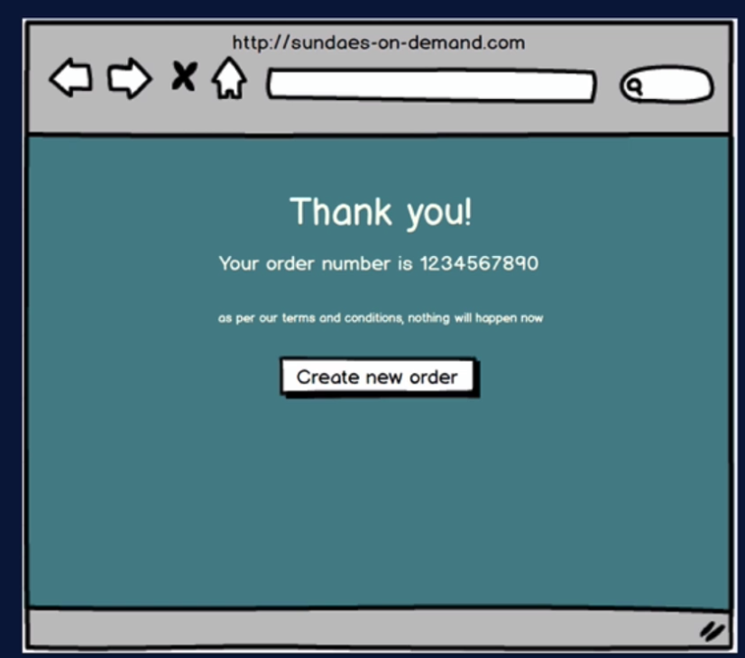

## App Summary

- Choose ice cream flavors and toppins and submit order
- Flavors and toppings come from server
- Order is sent to server

## Backdrop to Test...

- More complext user interations
  - Multiple form entry, moving through order phases
- Mouseover popup
  - Test hat element disappears from DOM
- Simulating server response
  - Mock service worker
- Async app updates
  - awating DOM changes
- global state via context

## Spoiler Alert!

- We will not be testing context implementation
  - only interested in testing behavior as seen by user!
- Tests no different if we used Redux, Mobx, etc
- Only difference is the test setup
  - make sure component is wrapped in context
  - ensure functionality
  - avoid errors

## App Specs

### Order Entry Mock-up

### Order Summary Mock-up

### Order Confirmation Mock-up

## Order Phase State (App-Level)

- inProgress -> review -> compledted -> inProgress....

## Server

- Download from course repo
  - https://github.com/bonnie/udemy-TESTING-LIBRARY/tree/main/sundae-server
  - Follow instructions in README.md to install
- RESTful API, runs on port 3030
- For flavors / toppins, just sends static info
  - in a real app, would com from db
- For order, simply generates random order number
- Server not needed for functional react app testing
  - use mock-service-worker to mock reponses from server
  - server for spec, manual acceptance testing
